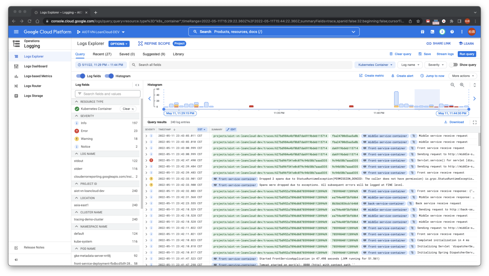

# Using `docker build` to build image

## Steps

- Build docker images at the root folder
    - `docker build -t front-service -f ./front-service/Dockerfile .`
    - `docker build -t middle-service -f ./middle-service/Dockerfile .`
    - `docker build -t back-service -f ./back-service/Dockerfile .`
- Tag images
    - `docker tag front-service asia.gcr.io/<project id>/front-service:0.3.0`
    - `docker tag middle-service asia.gcr.io/<project id>/middle-service:0.1.0`
    - `docker tag back-service asia.gcr.io/<project id>/back-service:0.1.0`
- Push images to gcp container registry
    - `docker push asia.gcr.io/<project id>/front-service:0.3.0`
    - `docker push asia.gcr.io/<project id>/middle-service:0.1.0`
    - `docker push asia.gcr.io/<project id>/back-service:0.1.0`
- Deploy applications
    - `kubectl apply -f kubernetes-front-service-gcp.yaml`
    - `kubectl apply -f kubernetes-middle-service-gcp.yaml`
    - `kubectl apply -f kubernetes-back-service-gcp.yaml`
- Get external ip of `front-service` application from `kubectl get svc`
  ```shell
  # Query kubernetes service info command
  kubectl get svc
  # Output sample
  NAME                 TYPE           CLUSTER-IP      EXTERNAL-IP     PORT(S)        AGE
  back-service-svc     LoadBalancer   10.102.131.1    34.80.143.76    80:32615/TCP   144m
  front-service-svc    LoadBalancer   10.102.128.11   34.80.176.214   80:32439/TCP   42m
  kubernetes           ClusterIP      10.102.128.1    <none>          443/TCP        3d4h
  middle-service-svc   LoadBalancer   10.102.130.39   34.81.86.5      80:31668/TCP   145m
  ```
- Access api via `https://<external ip of front service>/front-entry`
    - in this example: `https://34.80.176.214/front-entry`
- Go to GCP Operations Logging to see the logs 

# Using Jib to build image

## 說明

使用Google Jib建置Image並推送到Docker Daemon，再加上Image Tag並推送到Google Container Registry儲存。 使用Google
Jib建置Image的效率比使用`docker build`要來的優異許多，建置效率差異從原本需要3~5 min縮減到30 sec內，且第一次後建置會再提升至15 sec內完成。

## Prerequisites

- 已安裝Docker。

## Steps

- 取得Docker credentials: `docker login registry-1.docker.io`。
    - 若沒有取得credentials會顯示以下錯誤訊息：
  ```shell
  [ERROR] Failed to execute goal com.google.cloud.tools:jib-maven-plugin:3.2.1:dockerBuild (default-cli) on project back-service: Build to Docker daemon failed, perhaps you should make sure your credentials for 'registry-1.docker.io/library/eclipse-temurin' are set up correctly. See https://github.com/GoogleContainerTools/jib/blob/master/docs/faq.md#what-should-i-do-when-the-registry-responds-with-unauthorized for help: Unauthorized for registry-1.docker.io/library/eclipse-temurin: 401 Unauthorized
      [ERROR] {"details":"incorrect username or password"}
  ```
- 在parent pom.xml添加Google Jib設定:
  ```xml
  <project>
    <build>
      ...
      <!-- Defines plugins that are used in the modules. -->
      <pluginManagement>
        <plugins>
          <plugin>
            <groupId>com.google.cloud.tools</groupId>
            <artifactId>jib-maven-plugin</artifactId>
            <version>${jib.maven.version}</version>
            <configuration>
              <from>
                <image>openjdk:8-jre</image>
              </from>
            </configuration>
          </plugin>
        </plugins>
      </pluginManagement>
      ...
    </build>
  </project>
  ```
- 在sub-module的pom.xml設定Google Jib建置Image的細節設定，如建置好的Image名稱、版本等，這邊以`back-service`這個module為例：
  ```xml
  <project>
    ...
    <build>
        <plugins>
            <plugin>
                <groupId>com.google.cloud.tools</groupId>
                <artifactId>jib-maven-plugin</artifactId>
                <version>${jib.maven.version}</version>
                <configuration>
                    <to>
                        <image>${project.artifactId}:${back-service-version}</image>
                    </to>
                </configuration>
            </plugin>
        </plugins>
    </build>
    ...
  </project>  
  ```
  這邊使用placeholder: `${back-service-version}`保留版本設定的時間點，在建置Image時才一併指定Image
  version：`mvn compile jib:dockerBuild -pl back-service -Dback-service-version=0.2.0`
- 在root folder呼叫以下指令，分別建置`front-service`、`middle-service`以及`back-service`
  ```shell
  # 這邊指定每個Image的版本均為0.1.0
  mvn package jib:dockerBuild -pl front-service -Dfront-service-version=0.1.0
  mvn package jib:dockerBuild -pl middle-service -Dmiddle-service-version=0.1.0
  mvn package jib:dockerBuild -pl back-service -Dback-service-version=0.1.0
  ```
  使用`jib:dockerBuild`在Image建置成功時，會將Image先推送到Docker Daemon。
- 其後tag image與push image同使用`docker build`章節，這邊不再贅述。

---

# Others

- If you want to compile the project in the local machine, you need to obtain default GCP Application Default
  Credentials via `gcloud auth application-default login`
    - ref.: https://cloud.google.com/sdk/gcloud/reference/auth/application-default/login